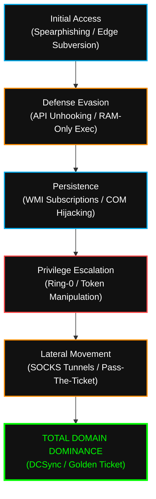

  

<pre>
███████╗███████╗ ██████╗  ██████╗██╗███████╗████████╗██╗   ██╗
██╔════╝██╔════╝██╔═══██╗██╔════╝██║██╔════╝╚══██╔══╝╚██╗ ██╔╝
█████╗  ███████╗██║   ██║██║     ██║█████╗     ██║    ╚████╔╝ 
██╔══╝  ╚════██║██║   ██║██║     ██║██╔══╝     ██║     ╚██╔╝  
██║     ███████║╚██████╔╝╚██████╗██║███████╗   ██║      ██║   
╚═╝     ╚══════╝ ╚═════╝  ╚═════╝╚═╝╚══════╝   ╚═╝      ╚═╝   
</pre>

# <samp>Tactical Doctrine & Methodology</samp>
**<samp>The Sovereign Blueprint | Operational Discipline & TTP Deployment</samp>**

 

<samp>Architect: <a href="https://github.com/fsoc-ghost-0x">C0deGhost</a> | Status: ACTIVE | Classification: LEVEL_5_RESTRICTED</samp>

  

 

> **[ DIRECTIVE LOG ]**
> **Purpose:** Standardization of APT Intrusion Operations, Arsenal Development, and Forensic Reporting.
> **Scope:** Applied strictly across all campaigns documented within `Fsociety_Operations_Logs.dat`.

 

## <samp>▌ <u>0x01_THE_PREDATOR_DISCIPLINE (PHILOSOPHY)</u></samp>

<samp>
Success is not the product of luck or an isolated exploit; it is the mathematical result of <b>Operational Discipline</b>. We do not improvise. Every keystroke, every payload compilation, and every lateral movement is engineered with millimeter precision.
</samp>

<samp>
Our methodology is built upon OPSEC supremacy, passive evasion, and team resilience. When we enter a hostile forest (Corporate Infrastructure), we are the shadow the Blue Team cannot track and the disaster they cannot foresee.
</samp>

 

## <samp>▌ <u>0x02_OPERATIONAL_PLANNING_&_STAGING</u></samp>

<samp>Every intrusion campaign begins in the dark, long before the first ICMP packet is sent.</samp>

| <samp>Phase</samp> | <samp>Operational Focus</samp> |
| :--- | :--- |
| <samp><b>1. Recon & Intelligence (OSINT)</b></samp> | <samp>Passive mapping of the target infrastructure. Extraction of exposed credentials, organizational charts, Cloud/On-Prem technology stacks, and human vulnerabilities (C-Level Profiling). Zero active contact.</samp> |
| <samp><b>2. Infrastructure Staging</b></samp> | <samp>Deployment of disposable C2 servers, Domain Fronting configuration, and routing tunnels (Tor/I2P). Creation of Malleable C2 profiles to blend our traffic with the target's legitimate operations.</samp> |
| <samp><b>3. Arsenal Synthesis</b></samp> | <samp>Selection and recompilation of weaponry from <code>Alderson_Core</code>. Implementation of polymorphic obfuscation (targeting the specific EDR signatures of the victim) and metadata stripping.</samp> |

 

## <samp>▌ <u>0x03_THE_FSOCIETY_KILL_CHAIN (BASIC METHODOLOGY)</u></samp>

<samp>The DNA sequence of our operations. A linear, deterministic, and lethal 5-phase model for the subjugation of any infrastructure.</samp>

 

### <samp>PHASE 1: RECON & INTELLIGENCE (OSINT)</samp>
> **Focus:** Passive mapping and shadow profiling.
> **Deployed TTPs:** Advanced OSINT, Counter-Intelligence, Offensive Threat Intelligence, and Credential Harvesting (Previous breaches, public repositories).
> **Objective:** Understand the human and technical topology before engaging the network.

### <samp>PHASE 2: INITIAL ACCESS & INFRASTRUCTURE MAPPING</samp>
> **Focus:** Active enumeration and entry vector localization.
> **Action:** Surgical scanning of the exposed attack surface, service analysis (Web, SSH, RDP, APIs), and mapping the Infrastructure Objective. Finding the perimeter fracture.

### <samp>PHASE 3: EXPLOITATION & REMOTE ACCESS</samp>
> **Focus:** Perimeter breach.
> **Action:** Weaponization of the discovered vulnerability. Payload injection and establishment of the beachhead (Shell Remote Access) within the target infrastructure. *The ghost has entered the forest.*

### <samp>PHASE 4: POST-EXPLOITATION & LATERAL MOVEMENT</samp>
> **Focus:** Expansion from the initial foothold (Patient Zero).
> **Action:** Mapping internal infrastructure (Active Directory / Internal Subnets). Execution of **LPE (Local Privilege Escalation)** vectors and deep enumeration. Aggressive *Credential Harvesting* in memory (LSASS, Shadow credentials) to pivot across adjacent systems.

### <samp>PHASE 5: POST ROOT & TOTAL DOMINANCE</samp>
> **Focus:** The systemic checkmate.
> **Action:** Escalation to absolute privileges (root / SYSTEM / Domain Admin). Installation of silent persistence agents (Ring-0 & Ring-3). **Plunder the Castle:** Seizure of cryptographic secrets, databases, and intellectual property. Absolute pivoting across the internal network.
> **Result:** *DOMAIN TOTAL DOMAIN.*

 

## <samp>▌ <u>0x04_TTP_DEPLOYMENT_STRATEGY (EXECUTION FLOW)</u></samp>

<samp>Tactical deployment executed under the MITRE ATT&CK standard, heavily adapted to our <i>"Living off the Land"</i> (LoTL) and in-memory persistence philosophy.</samp>

 

## <samp>▌ <u>0x05_OFFENSIVE_DEVELOPMENT_CYCLE</u></samp>

<samp>The creation of our weaponry (as stored in <code>Alderson_Core</code>) is not empirical; it is forensic mathematics.</samp>

- <samp><b>[+] THE DISSECTION PHASE:</b> All development begins in the Low-Level / RE laboratory. We analyze the binary, the protocol, or the Kernel. We understand how the machine works better than its creator.</samp>
- <samp><b>[+] THE POLYMORPHIC PHASE:</b> An exploit is not pushed to the vault if it triggers an alert. We apply polymorphic engineering, Syscall obfuscation, and Anti-Debugging techniques.</samp>
- <samp><b>[+] FAILURE AUTOPSY (The ELLIOT Protocol):</b> If a payload fails in the field, we extract the telemetry, map the crash dump, and rewrite the vector. Failure is the raw material for absolute success.</samp>

 

## <samp>▌ <u>0x06_THE_VERITAS_PROTOCOL (REPORTING)</u></samp>

<samp>An operation without documentation is vandalism. A documented operation is <b>State Intelligence</b>. Upon achieving Total Dominance, Agent <b>VERITAS</b> initiates reporting.</samp>

| <samp>Report Type</samp> | <samp>Target Audience</samp> | <samp>Focus & Delivery</samp> |
| :--- | :--- | :--- |
| <samp><b>TECHNICAL NARRATIVE</b></samp> | <samp>Blue Teams / Architects</samp> | <samp>Chronological forensic documentation, millimeter-precise TTP mapping, PCAP captures, memory dumps, and the dissection of how each technical security layer failed.</samp> |
| <samp><b>EXECUTIVE SYNTHESIS</b></samp> | <samp>C-Level / Board of Directors</samp> | <samp>Translation of technical chaos into Financial Impact and Business Risk. 3-to-5 page strategic briefs demonstrating why multi-million dollar defensive architectures collapsed.</samp> |

 

 
<i>"Loyalty is what keeps stone castles and empires standing; they remain impervious for centuries."</i>
  
<samp><strong>WE ARE FSOCIETY. WE ARE FINALLY FREE. WE ARE FINALLY AWAKE.</strong></samp>

