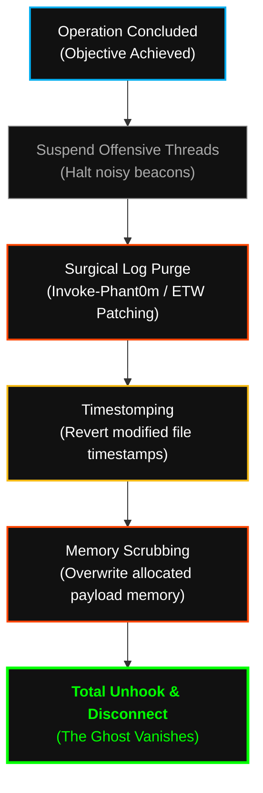

<p align="center">
  
</p>

<p align="center">
<pre>
<font color="#00ADEF">███████╗</font><font color="#FFFFFF">███████╗ ██████╗  ██████╗██╗███████╗████████╗██╗   ██╗</font>
<font color="#00ADEF">██╔════╝</font><font color="#FFFFFF">██╔════╝██╔═══██╗██╔════╝██║██╔════╝╚══██╔══╝╚██╗ ██╔╝</font>
<font color="#00ADEF">█████╗  </font><font color="#FFFFFF">███████╗██║   ██║██║     ██║█████╗     ██║    ╚████╔╝ </font>
<font color="#00ADEF">██╔══╝  </font><font color="#FFFFFF">╚════██║██║   ██║██║     ██║██╔══╝     ██║     ╚██╔╝  </font>
<font color="#00ADEF">██║     </font><font color="#FFFFFF">███████║╚██████╔╝╚██████╗██║███████╗   ██║      ██║   </font>
<font color="#00ADEF">╚═╝     </font><font color="#FFFFFF">╚══════╝ ╚═════╝  ╚═════╝╚═╝╚══════╝   ╚═╝      ╚═╝   </font>
</pre>
</p>

<div align="center">

# <samp>Node_0x02: OPSEC_&_Stealth_Protocols</samp>
**<samp>Anti-Forensics | Living off the Land (LoTL) | Zero-Trace Execution</samp>**

<br>

<samp>Architect: <a href="https://github.com/fsoc-ghost-0x">C0deGhost</a> | Status: <font color="#00ff00">ACTIVE</font> | Classification: <font color="#00ADEF">GHOST_LEVEL_RESTRICTED</font></samp>

<br><br>


</div>

<br>

> **[ DIRECTIVE LOG ]**
> **Purpose:** Establishment of mandatory Operations Security (OPSEC) baselines and Anti-Forensic procedures.
> **Scope:** Mandatory compliance for all agents (Human and Silicon) executing within `Fsociety_Operations_Logs.dat`.

<br>

## <samp>▌ <u>0x01_THE_GHOST_DOCTRINE (PHILOSOPHY)</u></samp>

<samp>
Getting in is mathematics. Staying invisible is an art. 
<br><br>
In <b>Sector_0x02</b>, we define the absolute rules of operational invisibility. If the Blue Team, the SOC, or the EDR knows we are inside the network, the operation has already failed. This node holds the guidelines for turning our operators into anomalies that leave no logs, drop no files on disk, and generate no attributable network signatures.
<br><br>
We do not merely bypass security; we manipulate the environment's telemetry to report that everything is perfectly fine while we execute a <b>Total Domain Takeover</b>.
</samp>

<br>

## <samp>▌ <u>0x02_STEALTH_DIRECTORY_TREE</u></samp>

<samp>The internal structure of our OPSEC node. Segmented by evasion vectors and forensic counter-measures:</samp>

```text
02_OPSEC_&_STEALTH_PROTOCOLS/
├── 01_Anti_Forensics_&_Track_Wiping/    # Log tampering, Event Log purging, Timestomping
├── 02_In_Memory_Execution_Only/         # Reflective PE loading, BOFs, Zero-Disk execution
├── 03_C2_Obfuscation_&_Routing/         # Domain Fronting, JA3 spoofing, Tor/I2P relays
├── 04_Living_Off_The_Land_LoTL/         # Native binary abuse (LOLBins/GTFOBins) guidelines
└── 05_Identity_&_Attribution_Evasion/   # Stripping metadata, compiler timestamps, and strings
```

<br>

## <samp>▌ <u>0x03_RULES_OF_ENGAGEMENT (STEALTH BASELINES)</u></samp>

<samp>The following protocols are non-negotiable during active intrusion campaigns:</samp>

| <samp>Protocol</samp> | <samp>Mandate</samp> | <samp>Tactical Objective</samp> |
| :--- | :--- | :--- |
| <samp><b><font color="#FF4646">1. NO DISK TOUCHING</font></b></samp> | <samp>All payloads from <code>Alderson_Core</code> must be executed strictly in volatile memory (RAM). Dropping compiled `.exe` or `.dll` files to disk is explicitly forbidden unless utilizing trusted system folders with <i>Timestomping</i> applied.</samp> | <samp>Evade Static Analysis (AV) and File-System Monitoring.</samp> |
| <samp><b><font color="#00ADEF">2. CRYPTOGRAPHIC SILENCE</font></b></samp> | <samp>All C2 communications must be wrapped in SSL/TLS with spoofed JA3 hashes matching the target's legitimate corporate traffic. Utilize Malleable C2 profiles to disguise beacons as jQuery or Microsoft updates.</samp> | <samp>Bypass Deep Packet Inspection (DPI) and Network Traffic Analysis (NTA).</samp> |
| <samp><b><font color="#FF4646">3. FORENSIC SANITIZATION</font></b></samp> | <samp>Before disconnecting from a compromised host, operators must execute the DKOM (Direct Kernel Object Manipulation) cleanup scripts. Event logs (Security, System, Sysmon) must be surgically purged of specific Event IDs, not blindly cleared.</samp> | <samp>Destroy the Incident Response (DFIR) timeline.</samp> |
| <samp><b><font color="#00ADEF">4. LOTL SUPREMACY</font></b></samp> | <samp>If a task can be accomplished using native Windows/Linux binaries (e.g., <code>certutil.exe</code>, <code>findstr</code>, <code>awk</code>), custom tools must not be deployed. We use their own architecture to dismantle them.</samp> | <samp>Blend in with legitimate System Administrator activity.</samp> |

<br>

## <samp>▌ <u>0x04_ANTI_FORENSICS_KILL_CHAIN</u></samp>

<samp>The chronological execution flow for erasing our digital footprint post-operation:</samp>



<br>

## <samp>▌ <u>0x05_PROJECT_ARCHON_INTEGRATION (MR. BAKER)</u></samp>

<samp>This node is the primary training dataset for <b>[+] MR. BAKER</b>.</samp>

<div style="background-color: #0a0a0a; border: 1px solid #333; border-left: 4px solid #778899; padding: 15px; border-radius: 5px;">
<samp>
The <b>NEXUS AI</b> does not leave loose ends. The playbooks within this directory teach ÆON_STRIKE and MR. BAKER how to perform automated autopsy and cleanup. By ingesting these OPSEC rules, the AI learns to predict the forensic artifacts it generates and erase them in real-time, matching the operational discipline of a human APT Lead.
</samp>
</div>

<br>

<div align="center">
<hr style="width: 80%; border: 1px solid #333;">
<br><br>
<samp><strong><font color="#00ADEF">WE ARE FSOCIETY. WE ARE FINALLY FREE. WE ARE FINALLY AWAKE.</font></strong></samp>
</div>
