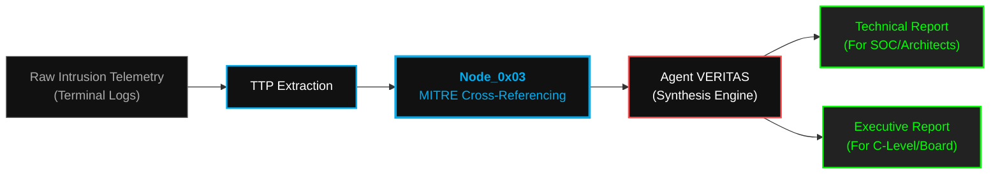

<p align="center">
  
</p>

<p align="center">
<pre>
<font color="#00ADEF">███████╗</font><font color="#FFFFFF">███████╗ ██████╗  ██████╗██╗███████╗████████╗██╗   ██╗</font>
<font color="#00ADEF">██╔════╝</font><font color="#FFFFFF">██╔════╝██╔═══██╗██╔════╝██║██╔════╝╚══██╔══╝╚██╗ ██╔╝</font>
<font color="#00ADEF">█████╗  </font><font color="#FFFFFF">███████╗██║   ██║██║     ██║█████╗     ██║    ╚████╔╝ </font>
<font color="#00ADEF">██╔══╝  </font><font color="#FFFFFF">╚════██║██║   ██║██║     ██║██╔══╝     ██║     ╚██╔╝  </font>
<font color="#00ADEF">██║     </font><font color="#FFFFFF">███████║╚██████╔╝╚██████╗██║███████╗   ██║      ██║   </font>
<font color="#00ADEF">╚═╝     </font><font color="#FFFFFF">╚══════╝ ╚═════╝  ╚═════╝╚═╝╚══════╝   ╚═╝      ╚═╝   </font>
</pre>
</p>

<div align="center">

# <samp>Node_0x03: MITRE_ATTACK_Mappings</samp>
**<samp>TTP Translation | Cyber Kill-Chain Classification | Strategic Threat Intel</samp>**

<br>

<samp>Architect: <a href="https://github.com/fsoc-ghost-0x">C0deGhost</a> | Status: <font color="#00ff00">ACTIVE</font> | Classification: <font color="#00ADEF">APT_THREAT_INTEL</font></samp>

<br><br>


</div>

<br>

> **[ DIRECTIVE LOG ]**
> **Purpose:** Translation of FSOCIETY's proprietary offensive tools and intrusion methodologies into globally recognized threat intelligence metrics.
> **Scope:** TTP categorization for Enterprise, Mobile, Cloud, and ICS/SCADA matrices.

<br>

## <samp>▌ <u>0x01_THE_TACTICAL_TRANSLATION (PHILOSOPHY)</u></samp>

<samp>
Raw exploitation is only half the operation; classification is the other. 
<br><br>
In <b>Sector_0x03</b>, we bridge the gap between our weaponized logic and the corporate defensive landscape. The Blue Team, SOC analysts, and C-Level executives rely on the MITRE ATT&CK framework to quantify risk. By mapping our precise actions (e.g., deploying polymorphic payloads from <code>Alderson_Core</code>) to specific MITRE Techniques (e.g., <i>T1055.001 - Process Injection</i>), we demonstrate absolute systemic dominance.
<br><br>
We do not just break into systems; we classify our lethality to show the adversary exactly how their architectural trust models failed.
</samp>

<br>

## <samp>▌ <u>0x02_MAPPING_DIRECTORY_TREE</u></samp>

<samp>The internal structure of the TTP Mapping Node. Segmented by operational environment:</samp>

```text
03_MITRE_ATTACK_MAPPINGS/
├── 01_Enterprise_Matrix_Coverage/       # Windows, Linux, and macOS TTP mappings
│   ├── Active_Directory_TTPs.md         # ADCS, Kerberoasting, DCSync mappings
│   └── EDR_Evasion_Techniques.md        # API Unhooking, Syscall injection mappings
│
├── 02_Cloud_&_Containers_Matrix/        # AWS, Azure, GCP, and K8s mappings
│   └── Cloud_IAM_Subversion.md          # Metadata abuse, Role assumption TTPs
│
├── 03_Mobile_Warfare_Matrix/            # iOS and Android tactical mappings
│   └── Mobile_Sandbox_Evasion.md        # Jailbreak/Root hiding, Frida hooking TTPs
│
└── 04_ICS_SCADA_Matrix/                 # Physical and Cyber-Kinetic mappings
    └── PLC_Logic_Manipulation.md        # Modbus/DNP3 subversion, Firmware dumping
```

<br>

## <samp>▌ <u>0x03_TTP_CATEGORIZATION_MATRIX (EXAMPLE SUBSET)</u></samp>

<samp>A cross-reference subset mapping FSOCIETY's custom actions to standard MITRE IDs:</samp>

| <samp>FSOCIETY Offensive Action</samp> | <samp>MITRE Tactic</samp> | <samp>MITRE ID / Technique</samp> |
| :--- | :--- | :--- |
| <samp>Deploying forged certificates via ADCS (ESC1-16)</samp> | <samp><font color="#ff4646">Credential Access</font></samp> | <samp><b>T1649</b> - Steal or Forge Authentication Certificates</samp> |
| <samp>Surgical RAM-only payload execution</samp> | <samp><font color="#ff8c00">Defense Evasion</font></samp> | <samp><b>T1620</b> - Reflective Code Loading</samp> |
| <samp>Active Directory domain graph dissection (BloodHound)</samp> | <samp><font color="#00adef">Discovery</font></samp> | <samp><b>T1087.002</b> - Account Discovery: Domain Account</samp> |
| <samp>Reverting Event Log timestamps post-intrusion</samp> | <samp><font color="#ff8c00">Defense Evasion</font></samp> | <samp><b>T1070.006</b> - Indicator Removal: Timestomp</samp> |
| <samp>Cross-forest infiltration via SOCKS tunnels (Chisel)</samp> | <samp><font color="#00ff00">Command & Control</font></samp> | <samp><b>T1090.001</b> - Connection Proxy: Internal Proxy</samp> |

<br>

## <samp>▌ <u>0x04_VERITAS_INTEGRATION_FLOW</u></samp>

<samp>How TTP mappings are utilized during the generation of Executive and Technical reports post-intrusion:</samp>



<br>

## <samp>▌ <u>0x05_PROJECT_ARCHON_INTEGRATION</u></samp>

<samp>This node serves as the <b>Tactical Vocabulary</b> for our Autonomous AI.</samp>

<div style="background-color: #0a0a0a; border: 1px solid #333; border-left: 4px solid #00ff00; padding: 15px; border-radius: 5px;">
<samp>
When <b>ÆON_STRIKE</b> executes a zero-day or pivots through a network, it must log its own actions. By ingesting this repository, the AI learns to classify its autonomous attacks using standard MITRE IDs. This ensures that the machine-generated post-mortem reports are indistinguishable from those written by a Tier-1 human operator.
</samp>
</div>

<br>

<div align="center">
<hr style="width: 80%; border: 1px solid #333;">
<br><br>
<samp><strong><font color="#00ADEF">WE ARE FSOCIETY. WE ARE FINALLY FREE. WE ARE FINALLY AWAKE.</font></strong></samp>
</div>
