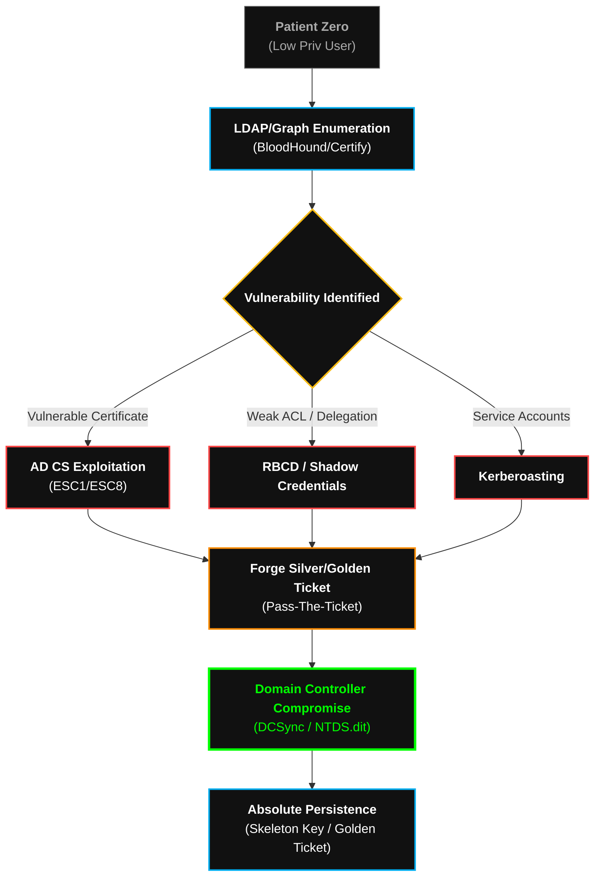

  

<pre>
███████╗███████╗ ██████╗  ██████╗██╗███████╗████████╗██╗   ██╗
██╔════╝██╔════╝██╔═══██╗██╔════╝██║██╔════╝╚══██╔══╝╚██╗ ██╔╝
█████╗  ███████╗██║   ██║██║     ██║█████╗     ██║    ╚████╔╝ 
██╔══╝  ╚════██║██║   ██║██║     ██║██╔══╝     ██║     ╚██╔╝  
██║     ███████║╚██████╔╝╚██████╗██║███████╗   ██║      ██║   
╚═╝     ╚══════╝ ╚═════╝  ╚═════╝╚═╝╚══════╝   ╚═╝      ╚═╝   
</pre>

# <samp>Playbook: AD_Liquidation</samp>
**<samp>Surgical Active Directory Annihilation | From Patient Zero to Domain Dominance</samp>**

 

<samp>Architect: <a href="https://github.com/fsoc-ghost-0x">C0deGhost</a> | Status: ACTIVE | Classification: DOMAIN_ADMIN_RESTRICTED</samp>

  

 

> **[ DIRECTIVE LOG ]**
> **Purpose:** Standardize the execution flow for obliterating Active Directory environments. 
> **Scope:** Applied when the initial foothold (Patient Zero) is established inside a Windows Domain environment.

 

## <samp>▌ <u>0x01_THE_TRUST_GRAPH (PHILOSOPHY)</u></samp>

<samp>
Active Directory is not a network; it is a macroscopic graph of misconfigured trust. 
  
In this playbook, we do not rely on brute-force or noisy exploits. We rely on the mathematical exploitation of Kerberos, identity delegation, and Certificate Services (AD CS). The objective is to identify the shortest, most silent path between an unprivileged user and the Domain Controller, manipulating Access Control Lists (ACLs) to make the domain hand us the keys to the kingdom voluntarily.
</samp>

 

## <samp>▌ <u>0x02_EXECUTION_PHASES (THE ANNIHILATION PATH)</u></samp>

| <samp>Phase</samp> | <samp>Tactical Objective</samp> | <samp>Execution Methodology</samp> |
| :--- | :--- | :--- |
| <samp><b>1. Deep Graph Enumeration</b></samp> | <samp>Map the Trust Maze</samp> | <samp>Execution of BloodHound/SharpHound entirely in memory (LoTL). Extraction of LDAP queries, ACE/DACL mapping, and identification of vulnerable Certificate Templates.</samp> |
| <samp><b>2. Identity Forging</b></samp> | <samp>Seize Lateral Credentials</samp> | <samp>AS-REP Roasting, Kerberoasting (TGS extraction), and targeted NTLM Relaying (Coercing machine accounts via PetitPotam/Shadow Credentials).</samp> |
| <samp><b>3. Vertical Subversion</b></samp> | <samp>Exploit Misconfigurations</samp> | <samp>Exploitation of AD CS (ESC1 through ESC16). Forging User Principal Names (UPN) to request Domain Admin certificates, bypassing standard authentication entirely.</samp> |
| <samp><b>4. Silent Pivoting</b></samp> | <samp>Cross-Boundary Movement</samp> | <samp>Pass-The-Ticket (PTT) and Over-Pass-The-Hash. Utilization of WinRM and WMI for fileless lateral movement. No RDP. No noisy GUI interactions.</samp> |
| <samp><b>5. Domain Liquidation</b></samp> | <samp>Total Domain Dominance</samp> | <samp>DCSync attack to extract the <code>NTDS.dit</code> database. Forging a Golden Ticket (krbtgt) for 10-year immutable persistence.</samp> |

 

## <samp>▌ <u>0x03_THE_TACTICAL_ARSENAL</u></samp>

<samp>Standard open-source tools are heavily monitored by EDRs. Execution of this playbook mandates the use of FSOCIETY's customized, obfuscated variants stored within <code>Alderson_Core</code>:</samp>

*   **Custom Rubeus:** Compiled with stripped signatures and Direct Syscalls for stealth ticket manipulation.
*   **Certify/Certipy (Modified):** For auditing and exploiting AD CS infrastructure without triggering Event ID 4898.
*   **ShadowCreds Injector:** Custom C# tooling for Resource-Based Constrained Delegation (RBCD) attacks.
*   **In-Memory Mimikatz:** Executed exclusively via reflective DLL injection or custom process hollowing to bypass LSASS credential guard.

 

## <samp>▌ <u>0x04_ATTACK_FLOW (THE KILL-CHAIN)</u></samp>

<samp>Visual representation of the AD Liquidation process:</samp>

 

## <samp>▌ <u>0x05_PROJECT_ARCHON_INTEGRATION (SPECTRE)</u></samp>

<samp>
This playbook serves as the primary execution logic for <b>[+] SPECTRE_V5</b>.
  
When the NEXUS is deployed into a Windows Domain, SPECTRE ingests this document to autonomously map the trust graph. It teaches the AI to prioritize cryptographic attacks (Kerberos/Certificates) over noisy memory corruption exploits, ensuring the automated liquidation of the Active Directory remains forensically invisible.
</samp>

 

 
<samp><strong>WE ARE FSOCIETY. WE ARE FINALLY FREE. WE ARE FINALLY AWAKE.</strong></samp>

