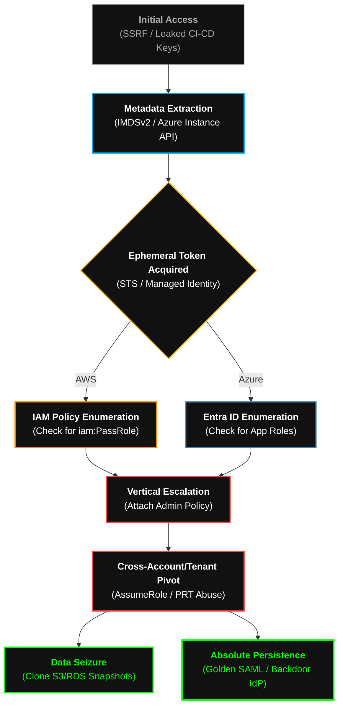

  

<pre>
███████╗███████╗ ██████╗  ██████╗██╗███████╗████████╗██╗   ██╗
██╔════╝██╔════╝██╔═══██╗██╔════╝██║██╔════╝╚══██╔══╝╚██╗ ██╔╝
█████╗  ███████╗██║   ██║██║     ██║█████╗     ██║    ╚████╔╝ 
██╔══╝  ╚════██║██║   ██║██║     ██║██╔══╝     ██║     ╚██╔╝  
██║     ███████║╚██████╔╝╚██████╗██║███████╗   ██║      ██║   
╚═╝     ╚══════╝ ╚═════╝  ╚═════╝╚═╝╚══════╝   ╚═╝      ╚═╝   
</pre>

# <samp>Playbook: Cloud_IAM_Subversion</samp>
**<samp>Control Plane Annihilation | Cross-Tenant Pivoting | Absolute IAM Dominance</samp>**

 

<samp>Architect: <a href="https://github.com/fsoc-ghost-0x">C0deGhost</a> | Status: ACTIVE | Classification: CLOUD_ROOT_RESTRICTED</samp>

  

 

> **[ DIRECTIVE LOG ]**
> **Purpose:** Standardize the execution flow for collapsing Cloud Environments via Identity and Access Management (IAM) abuse.
> **Scope:** Applied when the target infrastructure resides in AWS, Azure (Entra ID), or GCP. Focuses entirely on the Control Plane rather than individual compute instances.

 

## <samp>▌ <u>0x01_THE_IDENTITY_PERIMETER (PHILOSOPHY)</u></samp>

<samp>
In the Cloud, there is no network perimeter; <b>Identity is the perimeter</b>. 
  
This playbook discards traditional network exploitation. We do not care about port scanning EC2 instances. We target the <b>Control Plane</b>. By exploiting Server-Side Request Forgery (SSRF) to extract ephemeral tokens, abusing over-permissive IAM roles, and forging federated identities (Golden SAML), we turn the cloud provider's own management APIs into our weapon. If we control the IAM, we control the reality of the infrastructure.
</samp>

 

## <samp>▌ <u>0x02_EXECUTION_PHASES (THE CLOUD ANNIHILATION PATH)</u></samp>

| <samp>Phase</samp> | <samp>Tactical Objective</samp> | <samp>Execution Methodology</samp> |
| :--- | :--- | :--- |
| <samp><b>1. Foothold & Metadata Extraction</b></samp> | <samp>Breach the Compute Layer</samp> | <samp>Exploitation of SSRF vulnerabilities on exposed web applications to query the Instance Metadata Service (IMDSv1/IMDSv2). Extraction of ephemeral <code>STS AssumeRole</code> credentials. Alternatively, extraction of hardcoded AWS/Azure keys from exposed GitHub repositories or misconfigured CI/CD pipelines.</samp> |
| <samp><b>2. Cloud Control Plane Enum</b></samp> | <samp>Map the IAM Graph</samp> | <samp>Deployment of automated reconnaissance via Cloud APIs. Auditing attached policies, identifying "Shadow Admins", and mapping excessive permissions (e.g., <code>iam:PassRole</code>, <code>iam:AttachUserPolicy</code> in AWS; Privileged Role Assignments in Azure).</samp> |
| <samp><b>3. Vertical IAM Escalation</b></samp> | <samp>Seize Administrative Power</samp> | <samp>Self-elevation of privileges by attaching Administrator policies to the compromised identity. Abuse of Azure Primary Refresh Tokens (PRT) or Illicit Consent Grants in Entra ID to bypass MFA requirements.</samp> |
| <samp><b>4. Cross-Tenant & Lateral Pivot</b></samp> | <samp>Expand the Blast Radius</samp> | <samp>Abusing Cross-Account Trusts (AWS) or peering connections. Compromising the CI/CD pipeline (GitLab/GitHub Actions runners) to inject malicious Terraform/CloudFormation code, infecting future deployments.</samp> |
| <samp><b>5. Total Control Plane Seizure</b></samp> | <samp>Absolute Persistence</samp> | <samp>Execution of <b>Golden SAML</b> attacks to forge identity provider (IdP) responses, granting immutable, unlogged access to any cloud resource. Exfiltration of S3 buckets/Azure Blobs and RDS snapshots via VPC endpoints to avoid detection.</samp> |

 

## <samp>▌ <u>0x03_THE_TACTICAL_ARSENAL (CLOUD)</u></samp>

<samp>To evade CloudTrail, GuardDuty, and Azure Sentinel, we do not use standard frameworks out-of-the-box. We use customized, API-native tooling:</samp>

*   **Boto3/Azure-SDK Custom Wrappers:** Proprietary Python scripts that throttle API calls and spoof User-Agents (e.g., mimicking legitimate Terraform or AWS CLI traffic) to evade heuristic detection.
*   **Shadow-SAML Forger:** Internal tool for extracting the ADFS Token-Signing Certificate from an on-premise domain and generating forged SAML assertions to bypass cloud MFA.
*   **IMDSv2-Smuggler:** Specialized SSRF payloads designed to handle the PUT requests and token headers required to bypass modern AWS metadata protections.
*   **Ephemeral Persistence Injector:** Serverless functions (AWS Lambda / Azure Functions) deployed maliciously to execute persistence tasks asynchronously without triggering EC2 alerts.

 

## <samp>▌ <u>0x04_ATTACK_FLOW (THE KILL-CHAIN)</u></samp>

<samp>Visual representation of the Cloud Subversion process:</samp>

 

## <samp>▌ <u>0x05_PROJECT_ARCHON_INTEGRATION (ROMERO_V34)</u></samp>

<samp>
This playbook is the core operational matrix for <b>[+] ROMERO_V34</b>.
  
When the NEXUS engages a cloud infrastructure, ROMERO ingests this doctrine to understand that physical memory corruption is useless here. Instead, it weaponizes the Cloud API. The AI learns to parse complex JSON IAM policies in milliseconds, identifying the mathematical path to privilege escalation before the Cloud Provider's telemetry engines can raise a GuardDuty alert.
</samp>

 

 
<samp><strong>WE ARE FSOCIETY. WE ARE FINALLY FREE. WE ARE FINALLY AWAKE.</strong></samp>

