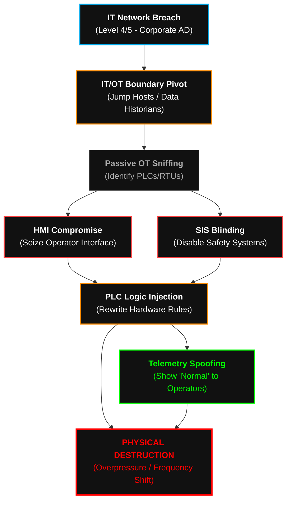

  

<pre>
███████╗███████╗ ██████╗  ██████╗██╗███████╗████████╗██╗   ██╗
██╔════╝██╔════╝██╔═══██╗██╔════╝██║██╔════╝╚══██╔══╝╚██╗ ██╔╝
█████╗  ███████╗██║   ██║██║     ██║█████╗     ██║    ╚████╔╝ 
██╔══╝  ╚════██║██║   ██║██║     ██║██╔══╝     ██║     ╚██╔╝  
██║     ███████║╚██████╔╝╚██████╗██║███████╗   ██║      ██║   
╚═╝     ╚══════╝ ╚═════╝  ╚═════╝╚═╝╚══════╝   ╚═╝      ╚═╝   
</pre>

# <samp>Playbook: ICS_SCADA_Infiltration</samp>
**<samp>Cyber-Kinetic Annihilation | Air-Gap Subversion | Physical Infrastructure Seizure</samp>**

 

<samp>Architect: <a href="https://github.com/fsoc-ghost-0x">C0deGhost</a> | Status: ACTIVE | Classification: KINETIC_ROOT_RESTRICTED</samp>

  

 

> **[ DIRECTIVE LOG ]**
> **Purpose:** Standardize the execution flow for penetrating isolated Operational Technology (OT) networks and subverting industrial control systems.
> **Scope:** Applied strictly against critical infrastructure, manufacturing plants, and energy grids where bridging the IT/OT Purdue Model is required.

 

## <samp>▌ <u>0x01_THE_KINETIC_FRONTIER (PHILOSOPHY)</u></samp>

<samp>
In standard enterprise hacking, the worst outcome is data loss. In <b>Sector_0x04</b>, the outcome is physical destruction. 
  
This playbook discards standard IT philosophy. We are not targeting databases; we are targeting turbines, centrifuges, and power grids. Industrial networks (OT) operate on blind trust and outdated protocols (Modbus, DNP3, S7) designed for reliability, not security. By piercing the air-gap, hijacking the Human-Machine Interfaces (HMI), and rewriting the Programmable Logic Controllers (PLCs), we translate digital commands into devastating physical-world consequences. We blind the operators while the machine destroys itself.
</samp>

 

## <samp>▌ <u>0x02_EXECUTION_PHASES (THE PURDUE COLLAPSE)</u></samp>

| <samp>Phase</samp> | <samp>Tactical Objective</samp> | <samp>Execution Methodology</samp> |
| :--- | :--- | :--- |
| <samp><b>1. The IT/OT Bridge</b></samp> | <samp>Pierce the Air-Gap</samp> | <samp>Compromise of the corporate IT network (Level 4/5) to locate Dual-Homed engineering workstations, Data Historians, or Jump Servers. Deployment of malicious hardware dropboxes (O.MG, SDR interceptors) if the network is strictly air-gapped.</samp> |
| <samp><b>2. Passive OT Enumeration</b></samp> | <samp>Map the Factory Floor</samp> | <samp>Strictly passive packet interception (PCAP analysis) to map the OT network (Level 1/2). Active scanning causes PLCs to crash. We silently identify vendors (Siemens, Rockwell, Schneider) and ICS protocols in use.</samp> |
| <samp><b>3. HMI & SIS Seizure</b></samp> | <samp>Blind the Operators</samp> | <samp>Compromise of the Human-Machine Interface (HMI) software via custom DLL hijacking or hardcoded credentials. Simultaneous subversion of the Safety Instrumented Systems (SIS) to ensure emergency shut-off valves fail to deploy during the kinetic event.</samp> |
| <samp><b>4. Firmware & Logic Injection</b></samp> | <samp>Reprogram the Physics</samp> | <samp>Injection of malicious Ladder Logic or compiled C/C++ firmware directly into the PLCs. Alteration of Holding Registers and Coils (Modbus/TCP) to force machinery beyond operational safety thresholds.</samp> |
| <samp><b>5. Kinetic Impact</b></samp> | <samp>Physical Annihilation</samp> | <samp>Execution of the <i>Stuxnet-Paradigm</i>: The HMI displays normal operating parameters to the engineers in the control room (Spoofing telemetry), while the PLC physically destroys the hardware (e.g., overriding pressure limits or altering rotor frequencies).</samp> |

 

## <samp>▌ <u>0x03_THE_TACTICAL_ARSENAL (ICS/OT)</u></samp>

<samp>Standard IT malware is noisy and ineffective in OT environments. Execution mandates specialized, low-level weaponry from <code>Alderson_Core</code>:</samp>

*   **Custom Protocol Fuzzers:** Python/C++ scripts designed to manipulate proprietary industrial protocols (S7comm, Ethernet/IP, DNP3) without triggering network anomaly detection.
*   **HMI Telemetry Spoofers:** In-memory implants injected into Scada/HMI processes (e.g., WinCC) to freeze variable states on the operator's screen, ensuring malicious physical changes go unnoticed.
*   **Logic-Bomb Injectors:** Frameworks to decompile, alter, and repackage PLC project files (Ladder Logic/Structured Text) in transit.
*   **RF/SDR Subverters:** Software Defined Radio tools for sniffing and injecting packets into wireless sensor networks (WirelessHART, Zigbee) in physically isolated environments.

 

## <samp>▌ <u>0x04_ATTACK_FLOW (THE KINETIC KILL-CHAIN)</u></samp>

<samp>Visual representation of the IT to OT infiltration process:</samp>

 

## <samp>▌ <u>0x05_PROJECT_ARCHON_INTEGRATION (KINETIC)</u></samp>

<samp>
This playbook serves as the execution core for <b>[+] KINETIC</b>.
  
When the NEXUS breaches an industrial environment, the AI delegates control to KINETIC. The system ingests this doctrine to understand that Nmap scans are lethal to fragile PLCs. It learns to read raw Modbus/S7 traffic off the wire passively, reverse-engineer the physical layout of the factory floor, and orchestrate physical damage while simultaneously manipulating the graphical data sent to the human engineers.
</samp>

 

 
<samp><strong>WE ARE FSOCIETY. WE ARE FINALLY FREE. WE ARE FINALLY AWAKE.</strong></samp>

