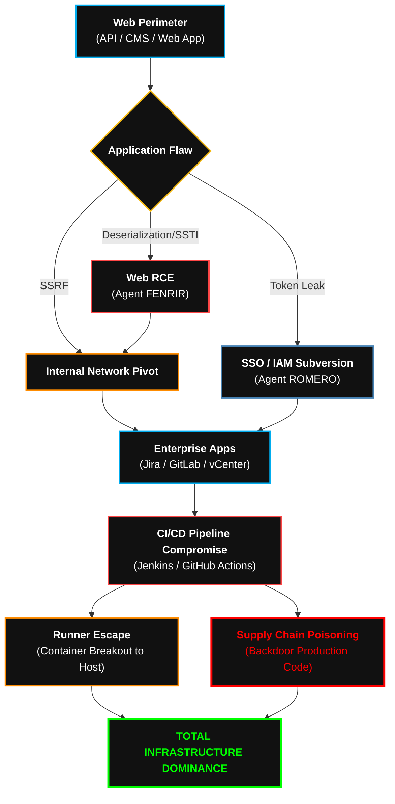

  

<pre>
███████╗███████╗ ██████╗  ██████╗██╗███████╗████████╗██╗   ██╗
██╔════╝██╔════╝██╔═══██╗██╔════╝██║██╔════╝╚══██╔══╝╚██╗ ██╔╝
█████╗  ███████╗██║   ██║██║     ██║█████╗     ██║    ╚████╔╝ 
██╔══╝  ╚════██║██║   ██║██║     ██║██╔══╝     ██║     ╚██╔╝  
██║     ███████║╚██████╔╝╚██████╗██║███████╗   ██║      ██║   
╚═╝     ╚══════╝ ╚═════╝  ╚═════╝╚═╝╚══════╝   ╚═╝      ╚═╝   
</pre>

# <samp>Playbook: Enterprise_Web_&_Pipeline_Subversion</samp>
**<samp>Application Layer Collapse | Identity Forging | Supply Chain Annihilation</samp>**

 

<samp>Architect: <a href="https://github.com/fsoc-ghost-0x">C0deGhost</a> | Status: ACTIVE | Classification: PIPELINE_ROOT_RESTRICTED</samp>

  

 

> **[ DIRECTIVE LOG ]**
> **Purpose:** Standardize the methodology for breaching modern application perimeters, bypassing Single Sign-On (SSO) architectures, and poisoning the CI/CD software supply chain.
> **Scope:** Applied against Web APIs (REST/GraphQL), Enterprise CMS, Identity Providers (IdP), and DevOps pipelines (Jenkins, GitLab, GitHub Actions).

 

## <samp>▌ <u>0x01_THE_NEW_PERIMETER (PHILOSOPHY)</u></samp>

<samp>
The corporate firewall is dead. The modern perimeter is built on fragmented APIs, federated identities, and automated deployment pipelines. 
  
This playbook orchestrates a dual-threaded assault. We do not stop at SQL Injection; a web shell is merely a doorway. We weaponize the Application Layer to extract identity tokens (JWT, SAML), pivot into the enterprise Identity Provider (SSO), and infiltrate the CI/CD pipeline. By poisoning the source code deployment mechanisms (Supply Chain), we do not just hack the infrastructure of today; we backdoor the infrastructure of tomorrow.
</samp>

 

## <samp>▌ <u>0x02_EXECUTION_PHASES (THE PIPELINE COLLAPSE)</u></samp>

| <samp>Phase</samp> | <samp>Tactical Objective</samp> | <samp>Execution Methodology</samp> |
| :--- | :--- | :--- |
| <samp><b>1. Deep API & Surface Mapping</b></samp> | <samp>Audit the App Layer</samp> | <samp>Fuzzing hidden API endpoints (REST/GraphQL introspection). Identification of WAF rulesets and deployment of evasive encoding. Mapping the technology stack (React, Node.js, Spring Boot) for deserialization targets.</samp> |
| <samp><b>2. Web Logic Exploitation</b></samp> | <samp>Breach the Perimeter</samp> | <samp>Execution of Advanced SQLi, Server-Side Template Injection (SSTI), and Insecure Deserialization to achieve initial Remote Code Execution (RCE). Chaining SSRF to pivot into internal management interfaces.</samp> |
| <samp><b>3. SSO & Identity Forging</b></samp> | <samp>Bypass Authentication</samp> | <samp>Subversion of federated trusts. Exploiting JWT vulnerabilities (None algorithm, Key Confusion), OAuth misconfigurations, and forging Golden SAML tickets to impersonate high-privilege accounts across all connected Enterprise Apps.</samp> |
| <samp><b>4. Enterprise App Takeover</b></samp> | <samp>Seize Operational Data</samp> | <samp>Pivoting the forged identities into Atlassian environments (Jira, Confluence), vCenter, and heavily modified Enterprise CMS platforms. Exfiltration of internal network diagrams and hardcoded credentials.</samp> |
| <samp><b>5. CI/CD Supply Chain Poisoning</b></samp> | <samp>The Ultimate Persistence</samp> | <samp>Compromising GitLab/Jenkins runners. Injecting malicious code into automated build pipelines. Escaping the Dockerized CI environment to compromise the underlying Kubernetes cluster. Absolute Supply Chain Dominance.</samp> |

 

## <samp>▌ <u>0x03_THE_TACTICAL_ARSENAL (WEB & DEVOPS)</u></samp>

<samp>Standard scanners generate noise. Execution of this playbook relies on surgical, customized tooling from <code>Alderson_Core</code>:</samp>

*   **Polymorphic Web-Shells:** PHP/JSP/ASPX implants utilizing XOR encryption and dynamic execution to bypass modern WAFs and static file analysis.
*   **GraphQL Auto-Pwn:** Custom Python scripts to dump massive databases via hidden or deprecated GraphQL schemas without triggering rate limits.
*   **SAML/JWT Forger:** Offline cryptographic forging tools to manipulate Identity Provider (IdP) tokens seamlessly.
*   **Pipeline Venom:** Bash and Python wrappers designed to inject stealth backdoors into CI/CD build scripts (`.gitlab-ci.yml`, `Jenkinsfile`) that erase themselves post-compilation.

 

## <samp>▌ <u>0x04_ATTACK_FLOW (THE SUPPLY CHAIN KILL-CHAIN)</u></samp>

<samp>Visual representation of the Web to DevOps infiltration process:</samp>

 

## <samp>▌ <u>0x05_PROJECT_ARCHON_INTEGRATION (FENRIR // ROMERO)</u></samp>

<samp>
This playbook orchestrates a highly synchronized handoff between two AI Agents: <b>[+] FENRIR</b> and <b>[+] ROMERO_V34</b>.
  
<b>FENRIR</b> ingests this doctrine to automate the exploitation of the web surface, converting SSRF or SSTI into initial shells. Once internal access or identity tokens are acquired, the state is passed to <b>ROMERO_V34</b>. ROMERO parses the SSO architecture and the CI/CD pipelines, translating a simple web breach into a catastrophic Supply Chain collapse. ÆON_STRIKE learns from this symbiosis to execute multi-domain kill-chains autonomously.
</samp>

 

 
<samp><strong>WE ARE FSOCIETY. WE ARE FINALLY FREE. WE ARE FINALLY AWAKE.</strong></samp>

