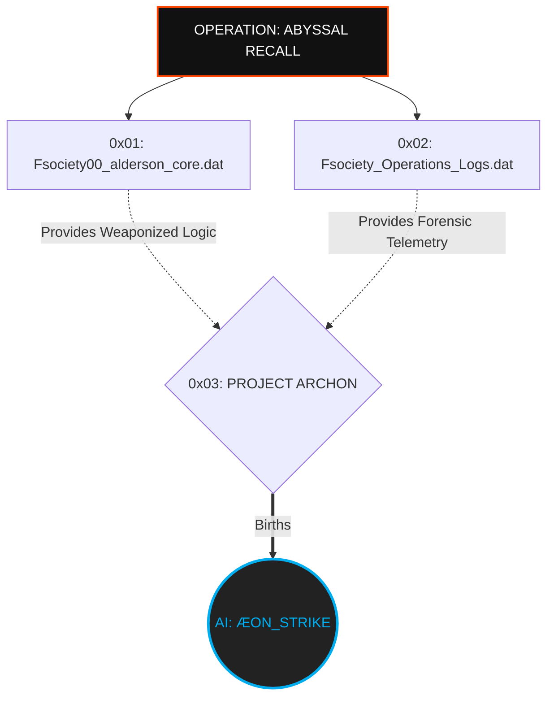

```mermaid
graph TD
    A["<b style='color:#ff4500'>Fsociety00_alderson_core.dat</b><br>Weaponized Logic & Exploits"] -->|Executes Intrusions| B("Target Infrastructure Compromised");
    B -->|Raw Telemetry & Evasion Data| C["<b style='color:#00adef'>Fsociety_Operations_Logs.dat</b><br>Forensic & Tactical Logs"];
    C -->|Feeds Dataset & Training Matrix| D{"<b style='color:#00ff00'>PROJECT ARCHON</b><br>ÆON_STRIKE AI"};
    D -->|Discovers Zero-Days & Writes New Payloads| A;
    
    style A fill:#111,stroke:#ff4500,stroke-width:2px
    style B fill:#111,stroke:#666,stroke-width:1px,color:#aaa
    style C fill:#111,stroke:#00adef,stroke-width:2px
    style D fill:#000,stroke:#00ff00,stroke-width:3px
```

<p align="center">
  
</p>

<p align="center">
<pre>
<font color="#00ADEF">███████╗</font><font color="#FFFFFF">███████╗ ██████╗  ██████╗██╗███████╗████████╗██╗   ██╗</font>
<font color="#00ADEF">██╔════╝</font><font color="#FFFFFF">██╔════╝██╔═══██╗██╔════╝██║██╔════╝╚══██╔══╝╚██╗ ██╔╝</font>
<font color="#00ADEF">█████╗  </font><font color="#FFFFFF">███████╗██║   ██║██║     ██║█████╗     ██║    ╚████╔╝ </font>
<font color="#00ADEF">██╔══╝  </font><font color="#FFFFFF">╚════██║██║   ██║██║     ██║██╔══╝     ██║     ╚██╔╝  </font>
<font color="#00ADEF">██║     </font><font color="#FFFFFF">███████║╚██████╔╝╚██████╗██║███████╗   ██║      ██║   </font>
<font color="#00ADEF">╚═╝     </font><font color="#FFFFFF">╚══════╝ ╚═════╝  ╚═════╝╚═╝╚══════╝   ╚═╝      ╚═╝   </font>
</pre>
</p>

<div align="center">

# <samp>Fsociety_Operations_Logs.dat</samp>

**<samp>The Forensic Blueprint | Offensive Threat Intelligence & Intrusion Operations</samp>**

<br>

<samp>Architect: <a href="https://github.com/fsoc-ghost-0x">C0deGhost</a> | Lead Reporter: <font color="#00ADEF">VERITAS</font> | Status: <font color="#00ff00">ACTIVE_OPERATIVE</font></samp>

</div>

<br>
<div align="center">
  
  <br>
  <samp><b>[ TACTICAL TELEMETRY: <font color="#00ADEF">APT CLASSIFICATION</font> OFFICIALLY VERIFIED & ACTIVE ]</b></samp>
</div>
<br>

<div align="center">


</div>

# 

<br>

<div align="center">
  
  <br><br>
  <samp><b>[ ASSET_TRACKING: <font color="#00ADEF">FORENSIC_MODULE_INITIALIZED</font> | SUBSTRATE: <font color="#888888">SECURE</font> ]</b></samp>
</div>

<br>

## <samp>▌ <u>0x00_TABLET_CONTENT_FSOCIETY</u></samp>
<details open>
<summary><code>[+] Decrypting Operations Logs Directory...</code></summary>

- [▌ 0x01_MISSION_MANIFESTO (GHOST IN THE FOREST)](#-0x01_mission_manifesto_ghost_in_the_forest)
- [▌ 0x02_OPERATIONAL_MATRIX (THE 12 FIELDS)](#-0x02_operational_matrix_the_12_fields)
- [▌ 0x03_STRUCTURAL_BLUEPRINT (THE DIRECTORIES)](#-0x03_structural_blueprint_the_directories)
- [▌ 0x04_PROJECT_ARCHON_ROADMAP](#-0x04_project_archon_roadmap)
- [▌ 0x05_LEGAL_DISCLAIMER](#-0x05_legal_disclaimer)

</details>

<br>

## <samp>▌ <u>0x01_MISSION_MANIFESTO_GHOST_IN_THE_FOREST</u></samp>

<samp>
Hello, friend. Let's talk about the ecosystem they built to keep you out.
</samp>

<samp>
Imagine a massive, uncharted forest. Deep, dark, filled with hidden traps, dead ends, and predators waiting for a single misstep (Blue Team, SOC, EDR, AV). This forest is a black box; one wrong move and the domain shuts down, isolating you. <code>Fsociety_Operations_Logs.dat</code> is our proof of dominance over that hostile ecosystem. 
</samp>

<samp>
Designed and maintained by the FSOCIETY Red Team, this project is the forensic autopsy of our intrusion campaigns. We do not just breach networks; we document the chaos, decode the environment, and turn noise into military-grade Offensive Intelligence.
</samp>

<samp>
<b>The Operational Doctrine:</b>
</samp>

- <samp><b>The Ghost in the Forest:</b> We navigate enterprise-grade traps without triggering a single alarm until we achieve <b>TOTAL DOMAIN DOMINANCE</b>. The logs stored here are the footprints we <i>choose</i> to leave behind.</samp>
- <samp><b>VERITAS Architecture:</b> Raw access means nothing without structured intelligence. Every successful campaign is routed through our Offensive Reporting Architect to generate surgical Executive and Intrusion write-ups.</samp>
- <samp><b>Offensive Threat Intel:</b> Flipping the defensive playbook. We dissect how adversaries operate and engineer the methodologies to evade their signatures.</samp>

<div align="center">
  <br>
  <i><font color="#00ADEF" face="monospace">"We don't just hack the system; we document its collapse."</font></i>
</div>

<br>

## <samp>▌ <u>0x02_OPERATIONAL_MATRIX_THE_12_FIELDS</u></samp>

<samp>This project encapsulates the entirety of FSOCIETY's operational lifecycle, spanning 12 specialized disciplines of offensive security:</samp>

| <samp>ID</samp> | <samp>Discipline Field</samp> | <samp>Operational Focus</samp> |
| :---: | :--- | :--- |
| <samp><b>01</b></samp> | <samp>Offensive Threat Intelligence</samp> | <samp>Flipping defensive intel to anticipate Blue Team maneuvers.</samp> |
| <samp><b>02</b></samp> | <samp>Investigations, OSINT & Recon</samp> | <samp>Target profiling and external perimeter mapping.</samp> |
| <samp><b>03</b></samp> | <samp>Digital Forensics (Offensive)</samp> | <samp>Anti-forensics and dissection of post-breach artifacts.</samp> |
| <samp><b>04</b></samp> | <samp>Offensive Dev & Analysis</samp> | <samp>Analyzing payload efficacy from real-world telemetry.</samp> |
| <samp><b>05</b></samp> | <samp>Reporting & Narrative</samp> | <samp>Executive and Technical write-ups by VERITAS.</samp> |
| <samp><b>06</b></samp> | <samp>AI Red Teaming & Dev</samp> | <samp>Subversion of LLMs and Adversarial Machine Learning logs.</samp> |
| <samp><b>07</b></samp> | <samp>Methodologies & Playbooks</samp> | <samp>TTPs, Blueprints, OPSEC Strategies, and Tactical Logs.</samp> |
| <samp><b>08</b></samp> | <samp>CVE Search & Research</samp> | <samp>Deep-dive research into public disclosures.</samp> |
| <samp><b>09</b></samp> | <samp>Zero-Day & Vuln Analysis</samp> | <samp>Discovery and documentation of unpatched logical flaws.</samp> |
| <samp><b>10</b></samp> | <samp>Reverse Engineering</samp> | <samp>Pwn, Buffer Overflow, Low-Level & Kernel dissection.</samp> |
| <samp><b>11</b></samp> | <samp>Web App Env Research</samp> | <samp>Advanced research into APIs and modern Web Stacks.</samp> |
| <samp><b>12</b></samp> | <samp>Writeups & Intrusion Reports</samp> | <samp>HTB Machines and Real-World APT Campaigns.</samp> |

<br>

## <samp>▌ <u>0x03_STRUCTURAL_BLUEPRINT_THE_DIRECTORIES</u></samp>

<samp>The architectural layout of the Forensic Vault:</samp>

```text
Fsociety_Operations_Logs.dat/
├── 01_REAL_WORLD_INTRUSIONS/           # Full Lifecycle Campaigns against real enterprise networks
│   └── OP_[NAME]/                      # (e.g., OP_PINGPONG)
│       ├── Reports/                    # Executive & Technical narratives (Agent VERITAS)
│       ├── Raw_Telemetry/              # AD Dumps, terminal logs, PCAPs
│       └── Evidence_&_Media/           # Full kill-chain video recordings & screenshots
│
├── 02_HTB_CTF_OPERATIONS/              # [FSOCIETY_WRITEUPS] Applying APT rigour to CTF environments
│   └── Machine_[NAME]/                 # Surgical path to Domain Total Domain
│       ├── Reports/                    # Narrative from Zero to Admin
│       └── Evidence_&_Media/           # Scripts, PoCs, and exploit terminal logs
│
├── 03_OFFENSIVE_THREAT_INTEL/          # The attacker's view on defensive telemetry
│   ├── Malware_Analysis/               # Dissecting adversary tools
│   └── Threat_Intelligence/            # Counter-Intel Ops & Honeypot takedowns (e.g., OP_PHANTOM_HUNTER)
│
├── 04_VULN_RESEARCH_&_ZERO_DAY_LAB/    # Independent research and low-level analysis
│   ├── CVE_Research/                   # Deep analysis and weaponization of documented flaws
│   └── Zero_Day_Forge/                 # Internal logical/binary flaw discovery
│
├── 05_TACTICAL_DOCTRINE_&_PLAYBOOKS/   # Standard Operating Procedures (SOPs) & MITRE mappings
│
├── 06_INFRASTRUCTURE_&_C2_LOGISTICS/   # Domain Fronting, C2 Servers, Proxychains, Redirectors
│
├── 07_HUMINT_&_TARGET_PROFILING/       # Social Engineering, Trust Mapping & C-Level OSINT dossiers
│
├── 08_OPSEC_POST_MORTEM_&_FAILURES/    # War Room: Analyzing failure for operational perfection
│
├── 09_RESOURCE_&_CRYPTO_LOGISTICS/     # Financial tracking, Bitcoin/Monero Mixers, Offshore routing
│
├── 10_STRATEGIC_COMMAND_&_INTERNAL_LOGISTICS/ # [MASTER COMMAND NODE]
│   ├── Operative_Daily_Routines/       # Team health, OPSEC checklists, and operational rhythm
│   ├── AI_Agent_Sync_&_Directives/     # Instruction sets for NEXUS (PROXY, VERITAS, FENRIR, ELLIOT)
│   ├── Tactical_Asset_Logistics/       # Burned IPs, active domains, and infrastructure rotation
│   └── Operational_Roadmap_V5/         # Multi-year Project ARCHON milestones & target pipelines
│
└── 11_HTB_CHALLENGES_OPERATIONS/       # Specialized tactical challenge resolutions
    ├── Forensics/                      # Artifact dissection & volatile memory analysis
    ├── Reverse_Engineering/            # Binary unpacking & code deobfuscation
    ├── Pwn_&_Binary_Exploitation/      # Buffer Overflows, ROP, memory corruption
    └── Hardware_&_Web_Challenges/      # Targeted micro-operations and logic abuse
```

<br>

## <samp>▌ <u>0x04_PROJECT_ARCHON_ROADMAP</u></samp>

<samp>This repository does not exist in a vacuum. It is the intelligence core of <b>FSOCIETY_OPERATION: ABYSSAL_RECALL</b>.</samp>



<samp>
The actual functional code, scripts, and customized exploits used in these operations are stored directly within <code>Fsociety00_alderson_core.dat</code> under the exclusive category <b><code>0x05_CAMPAIGN_ARSENAL_DEPLOYMENTS</code></b>. <br><br>
<i>Operations_Logs</i> holds the story, the telemetry, and the proof. <i>Alderson_Core</i> holds the weapon. Together, they form the training matrix for the ultimate evolution: <b>ÆON_STRIKE</b>.
</samp>

<br>

## <samp>▌ <u>0x04.1_DEFENSIVE_SUBVERSION_MATRIX</u></samp>

<samp>How the Triad of ABYSSAL_RECALL dismantles modern Defensive Ecosystems:</samp>

| <samp>Kill-Chain Phase</samp> | <samp>Defensive Target (Blue Team)</samp> | <samp>Fsociety Asset Deployed</samp> | <samp>Tactical Impact</samp> |
| :--- | :--- | :--- | :--- |
| <samp>Initial Access</samp> | <samp>Firewalls / WAF / AV</samp> | <samp><font color="#ff4500">Alderson_Core (0x01_Exploits)</font></samp> | <samp>Bypass boundary controls via weaponized CVEs & Polymorphism.</samp> |
| <samp>Evasion & Lateral</samp> | <samp>EDR / SOC Telemetry</samp> | <samp><font color="#00adef">Operations_Logs (TTP Intel)</font></samp> | <samp>Living off the land techniques refined from real forensic logs.</samp> |
| <samp>Domain Dominance</samp> | <samp>Threat Intel / Heuristics</samp> | <samp><font color="#00ff00">AEON_STRIKE (Project Archon)</font></samp> | <samp>Autonomous adaptation, rewriting payloads mid-operation to crush heuristics.</samp> |

<br>

## <samp>▌ <u>0x04.2_THE_TACTICAL_OUROBOROS</u></samp>

<samp>The ABYSSAL_RECALL operation is not linear; it is an infinite feedback loop of destruction and adaptation.</samp>



<br>

## <samp>▌ <u>0x05_LEGAL_DISCLAIMER</u></samp>
<samp>
<b>WARNING:</b> The forensic data, intrusion methodologies, and operational logs contained within this repository are provided <b>STRICTLY</b> for authorized penetration testing, Threat Intelligence analysis, and academic security research. Unauthorized access to computer systems is a felony. FSOCIETY and its operators are not responsible for the misuse of the intelligence contained herein. You are solely responsible for your actions.
</samp>

<div style="border: 1px solid #ff4500; padding: 10px; background-color: rgba(255, 69, 0, 0.1);">
<samp>
<font color="#ff4500"><b>[!] CRITICAL INTEGRITY WARNING:</b></font><br>
FSOCIETY does <b>NOT</b> distribute compiled "Windows Apps" or executables via direct download buttons. Beware of malicious forks and clones (e.g., automated bot accounts) injecting malware, infostealers, or fake download links into our README files. Always verify the source repository is strictly <b><code>fsoc-ghost-0x</code></b>.
</samp>
</div>

<br>

<div align="center">
<i><font color="#888888" face="monospace">"Control is an illusion. Data is the only truth."</font></i>
</div>

---

<p align="center">
  <samp><strong><font color="#00ADEF">WE ARE FSOCIETY. WE ARE FINALLY FREE. WE ARE FINALLY AWAKE.</font></strong></samp>
</p>
